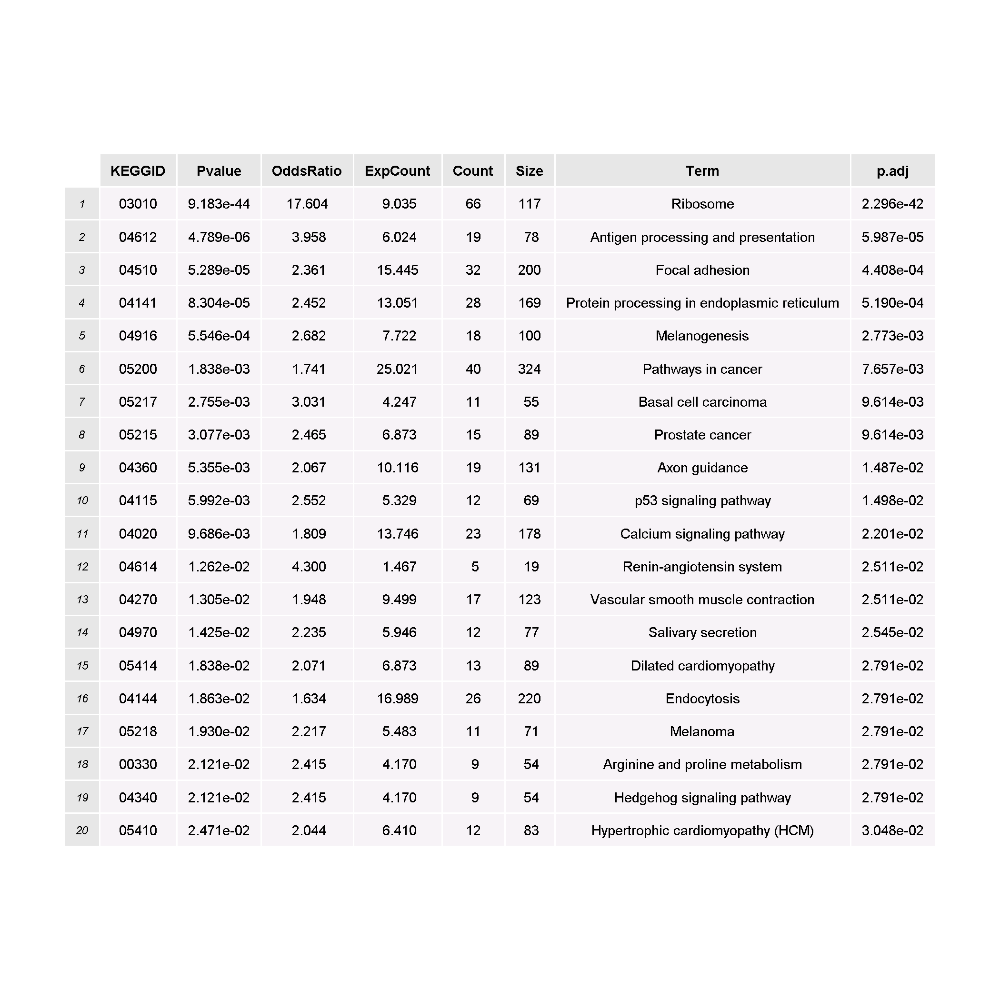
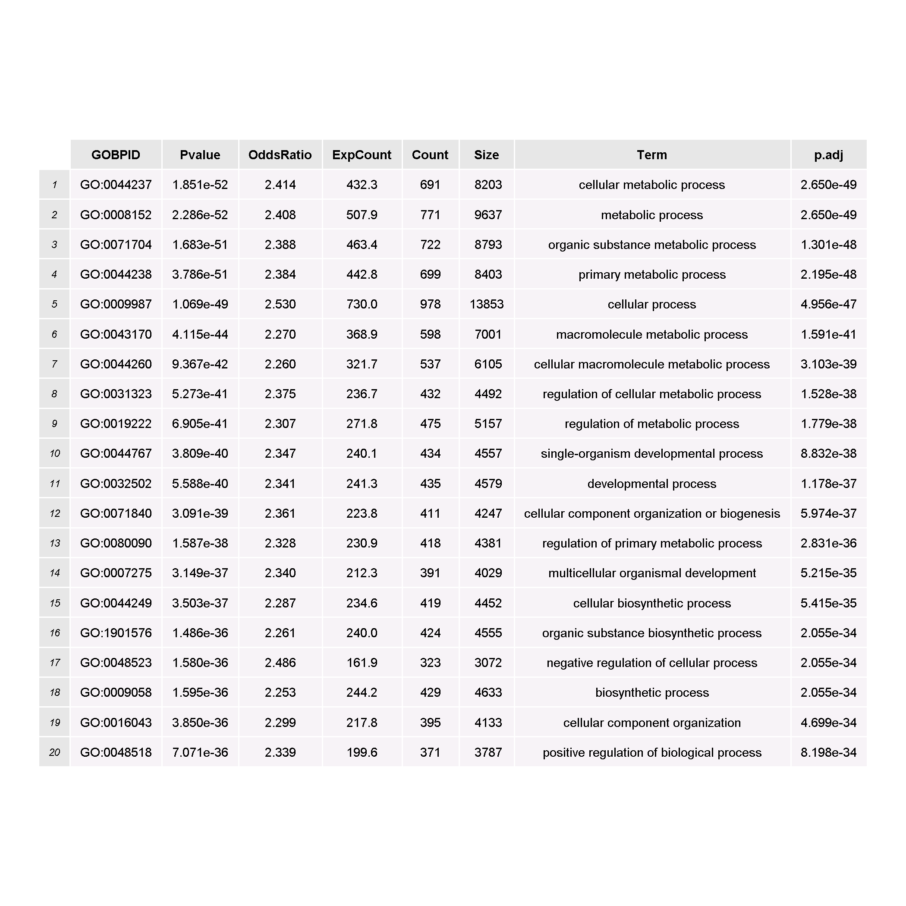
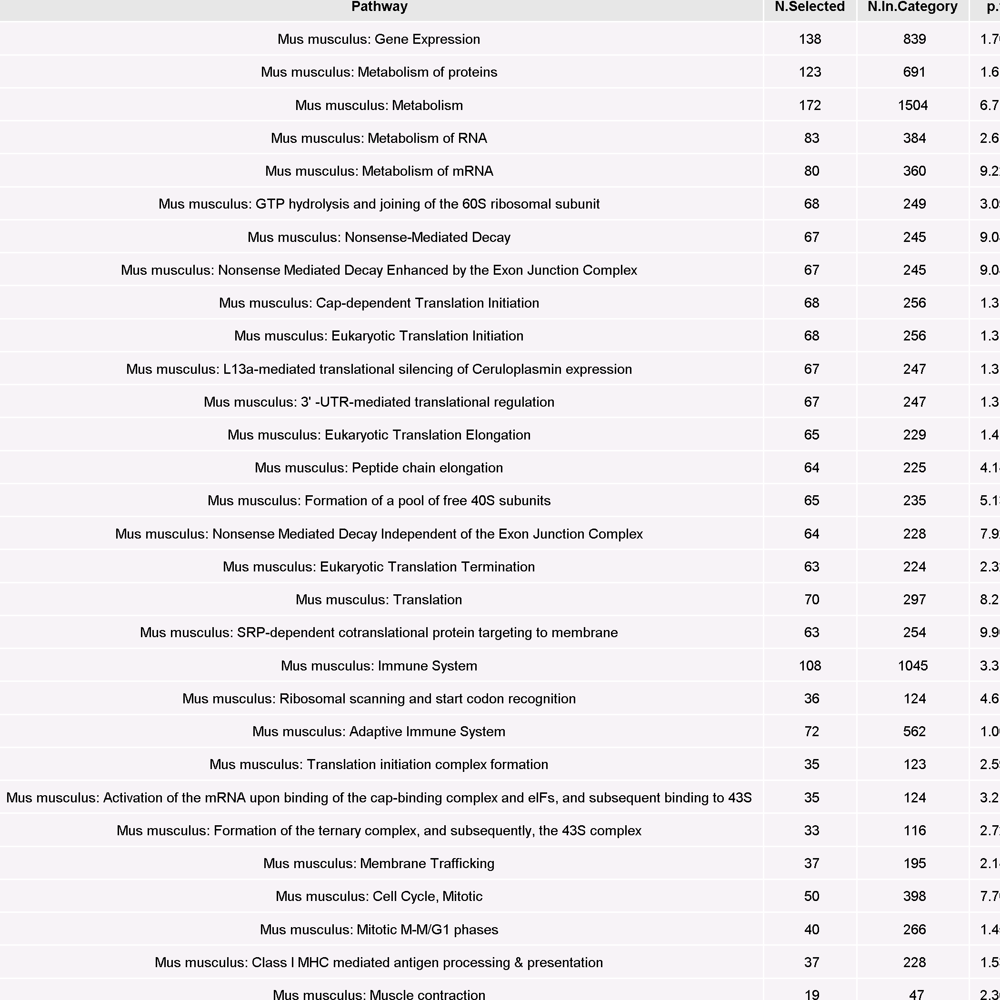

Differential gene expression
========================================================

```
## estimating size factors
## estimating dispersions
## gene-wise dispersion estimates
## mean-dispersion relationship
## final dispersion estimates
## fitting model and testing
```

First, we check how many genes are differentially expressed


```
## Number of differentially expressed PROBES: 1398
## Number of differentially expressed GENES: 1382
```

Some probes map to multiple genes, hence the discrepancy in counts of probes and genes. 

KEGG enrichment analysis
----------------------------------------------

```
## 
## KEGG.db contains mappings based on older data because the original resource was removed from the the public
##   domain before the most recent update was produced. This package should now be considered deprecated and
##   future versions of Bioconductor may not have it available.  Users who want more current data are
##   encouraged to look at the KEGGREST or reactome.db packages
## 
## The number of enriched KEGG :25
```



GO enrichment analysis
----------------------------------------------

```
## The number of enriched GO :2319
```



Reactome enrichment analysis
----------------------------------------------

```
## The number of enriched Reactome pathways:355
```


