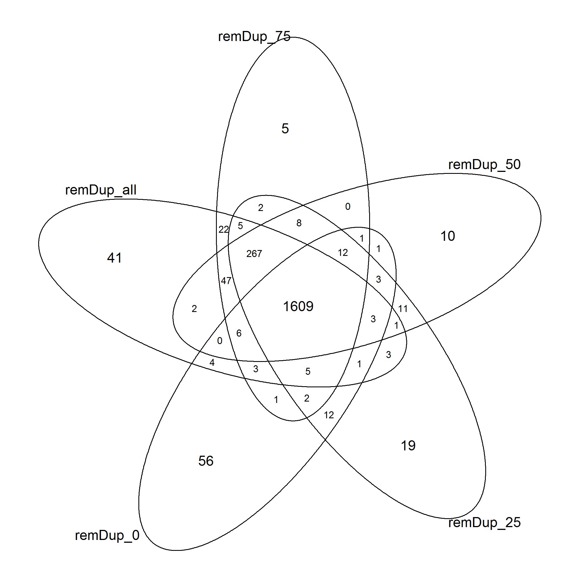
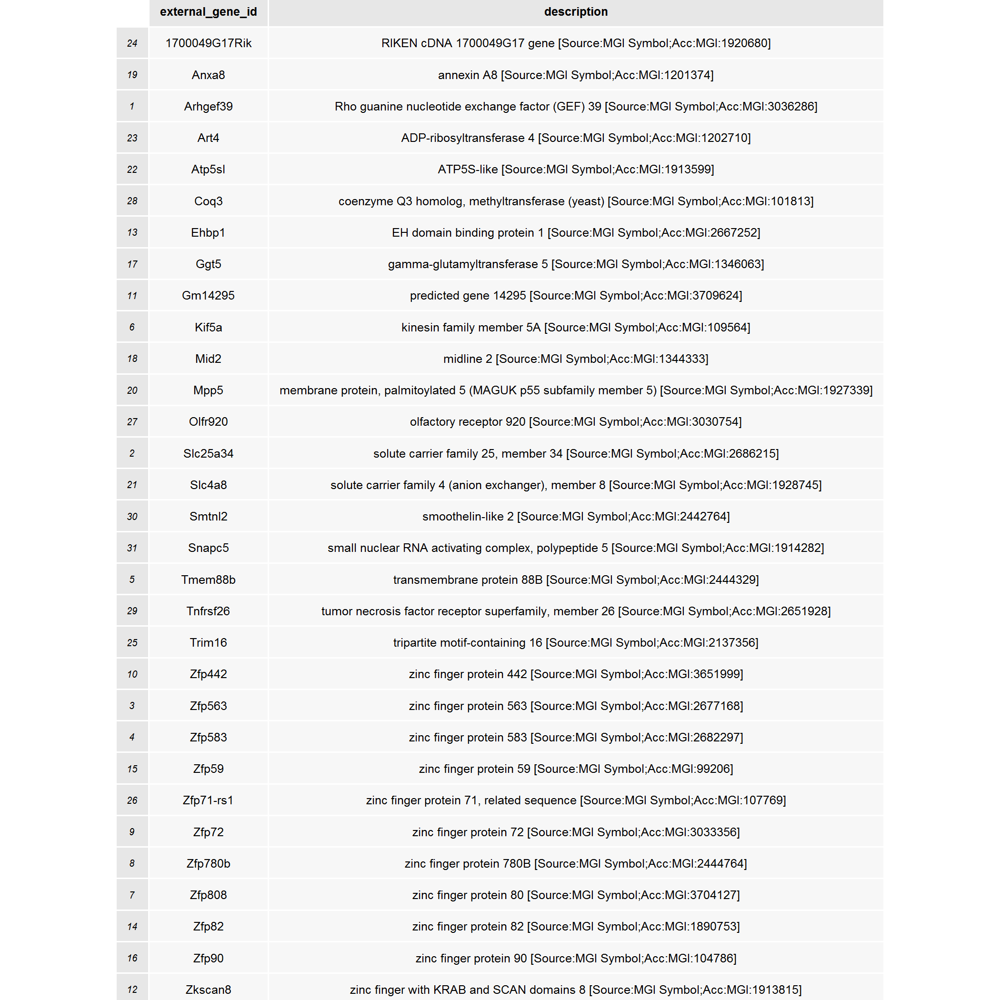
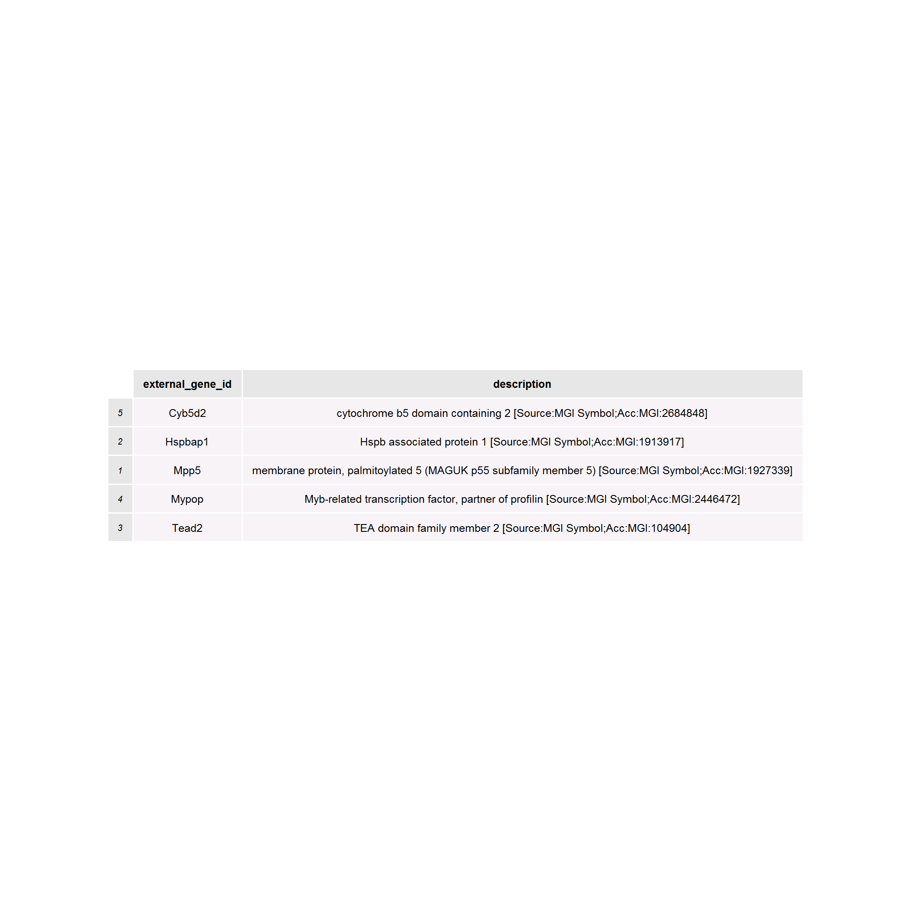
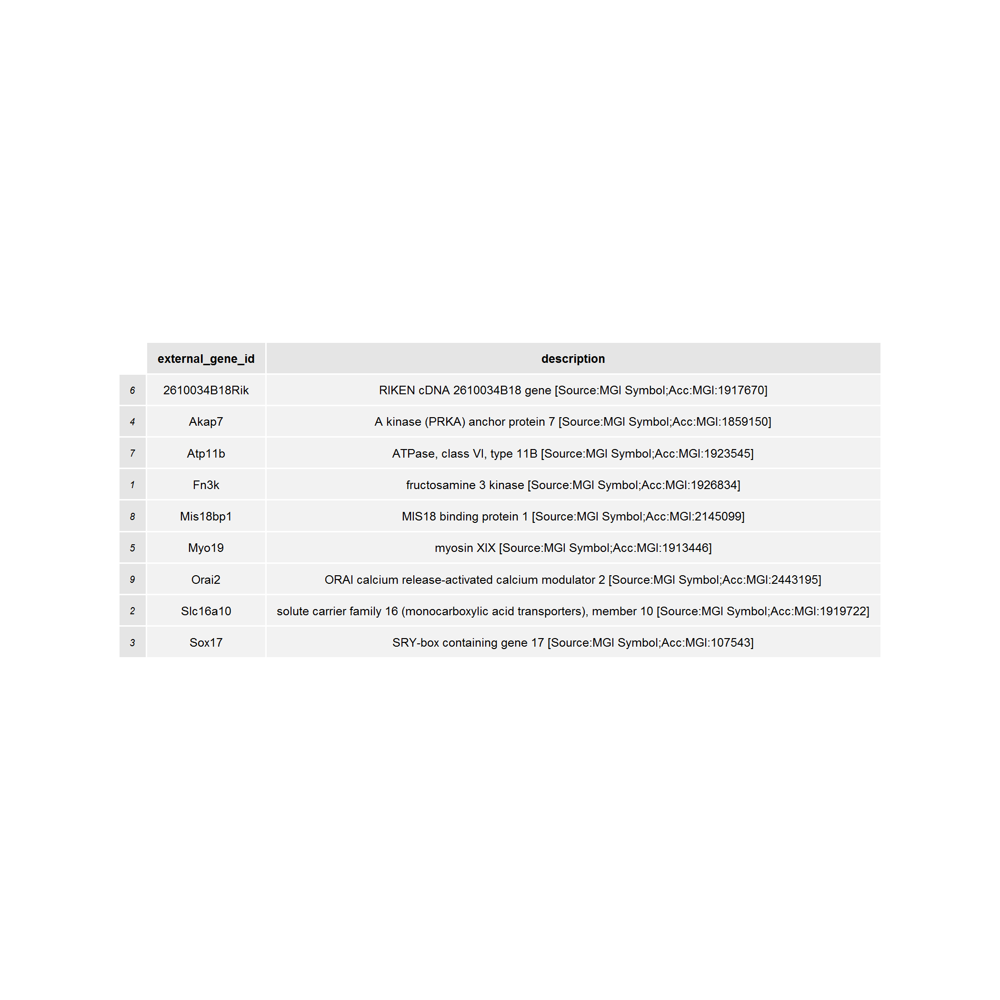
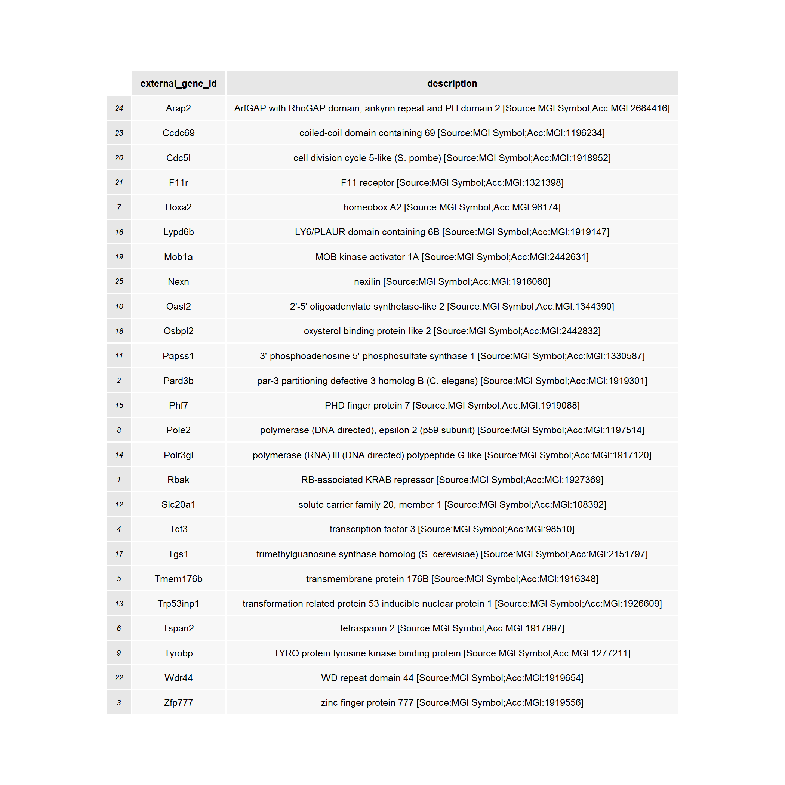
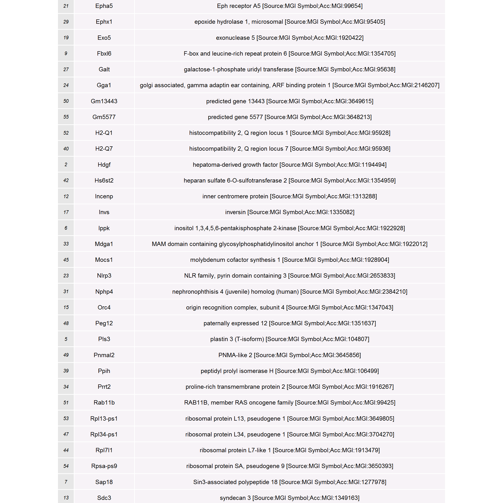

RepeatSoaker effect on DEGs detection
========================================================


Overlap among DEGs identified in the non-soaked data (index [[1]]) and RepeatSoaked data at 75%, 50, 25 and 1% thresholds (subsequent indexes).


```
##  all  r75  r50  r25  r01 
## 2062 2049 2043 2028 1885
```




We observe that soaking diminishes the number of differentially expressed genes. More rigorous soaking (less strict overlap threshold) also increases the number of genes not detected previously.

Withour RepeatSoaker, we have (all genes in the sig_genes_names[[1]] oval):


```
## Number of differentially expressed PROBES, no RepeatSoaker: 2062
## Number of differentially expressed GENES, no RepeatSoaker: 2895
```


Some probes map to multiple genes, hence the discrepancy in numbers. 

After trimming the data with all RepeatSoaker settings, we have (the center of the Venn diagram):


```
## Number of differentially expressed PROBES, with RepeatSoaker: 1634
## Number of differentially expressed GENES, with RepeatSoaker: 2302
```


Later, we compare these gene lists (Genes without vs. Genes with RepeatSoaker) for biological meaning.


Now, we check what those genes unique to each RepeatSoaker % are. We will look at 3 things:

1) Gene names and their description. Note that not all probes can be mapped to genes, and some probes map to the same gene - therefore, the numbers in the Venn diagram and the tables below differ.

2) GO and Pathway enrichment of those genes, if any. (featureNames from cummeRbund conflicts with org.Mm.ed.db package, see **Analysis_RepeatSoaker_genes.md** document)

Genes unique for different RepeatSoaker settings
-------------------------------------------------


```
## Unique genes for non-RepeatSoaked data
```




```
## Unique genes for 75%-RepeatSoaked data
```




```
## Unique genes for 50%-RepeatSoaked data
```




```
## Unique genes for 25%-RepeatSoaked data
```




```
## Unique genes for 0%-RepeatSoaked data
```




