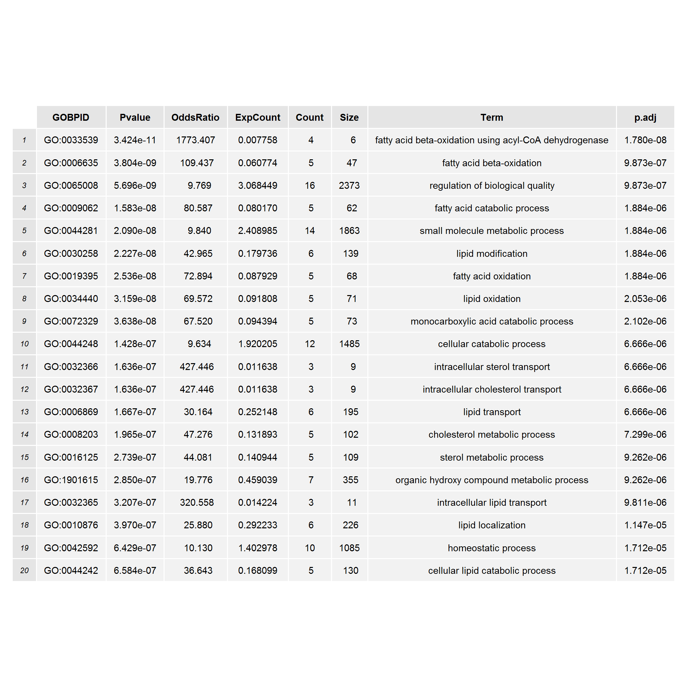
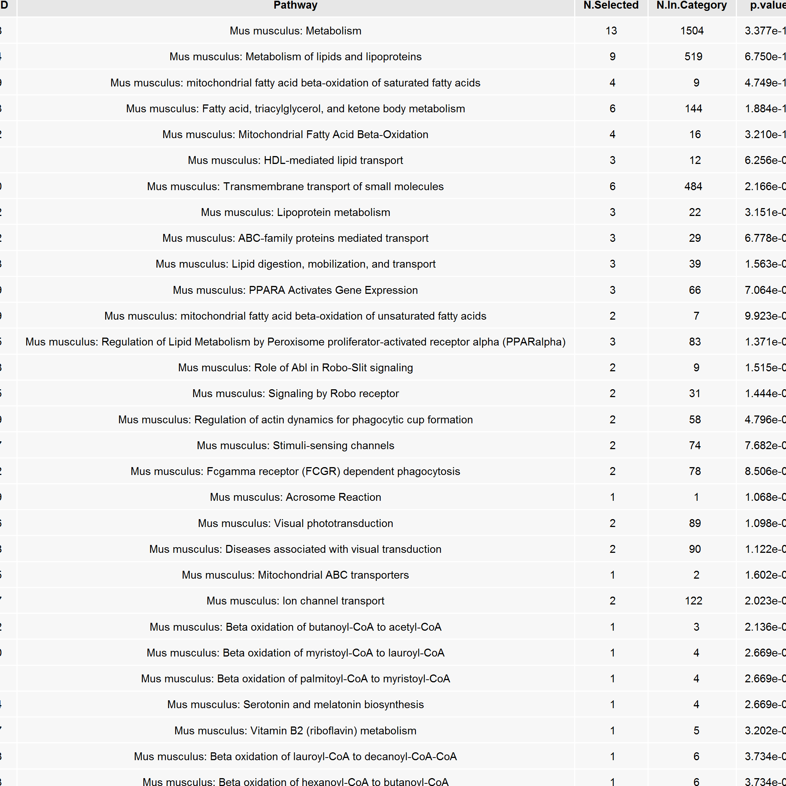
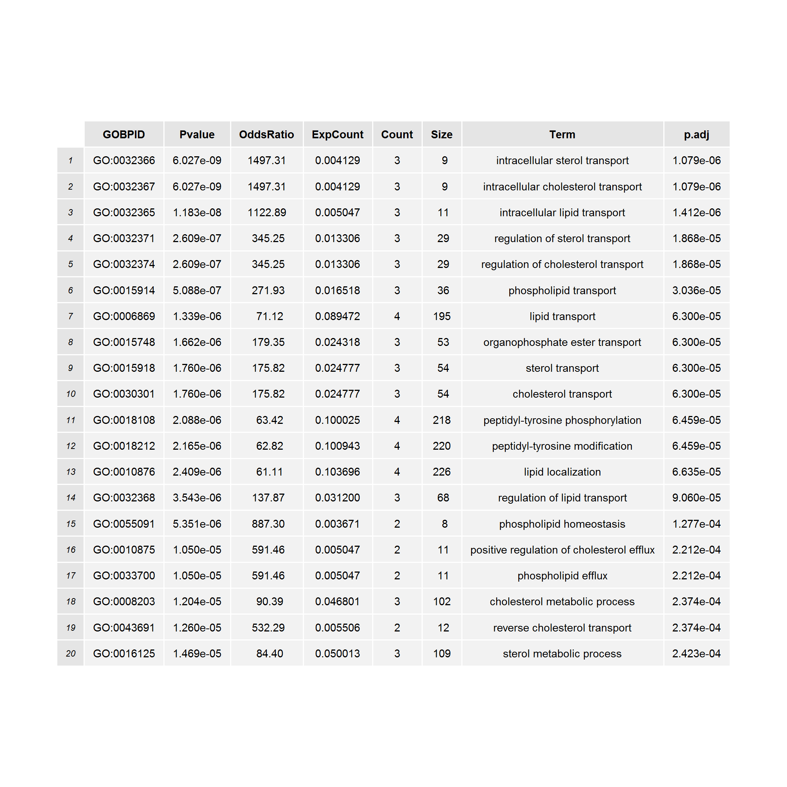
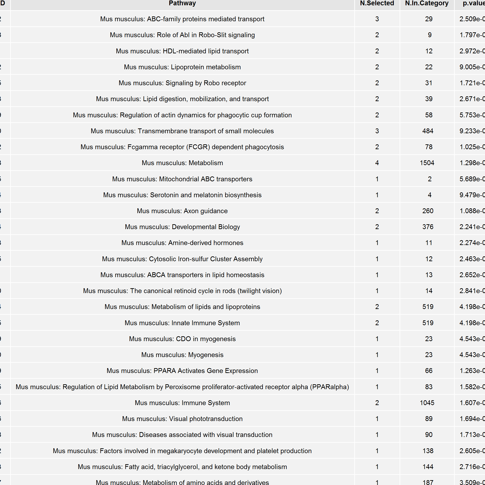
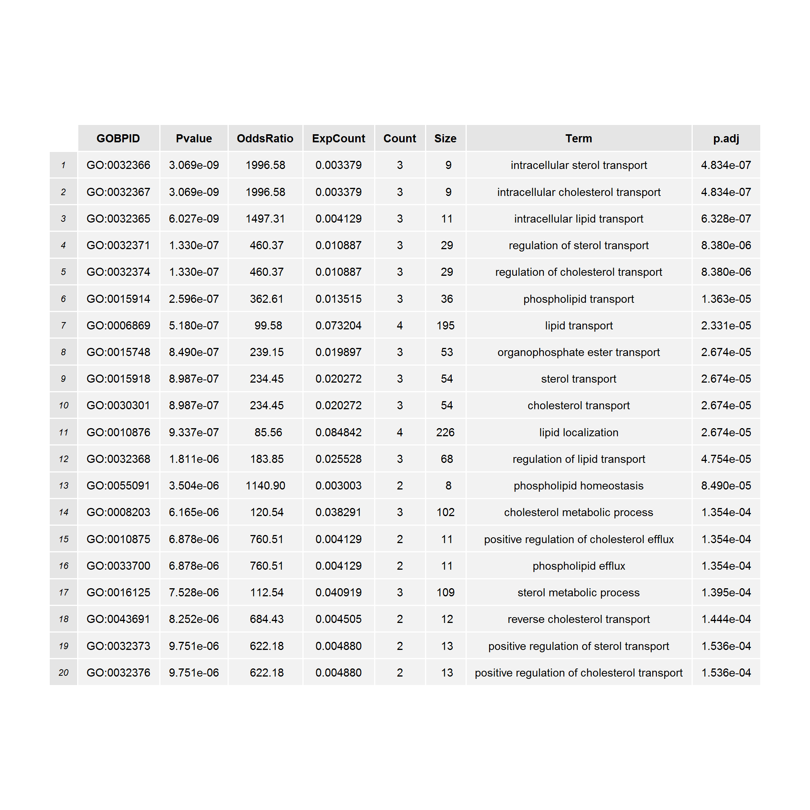
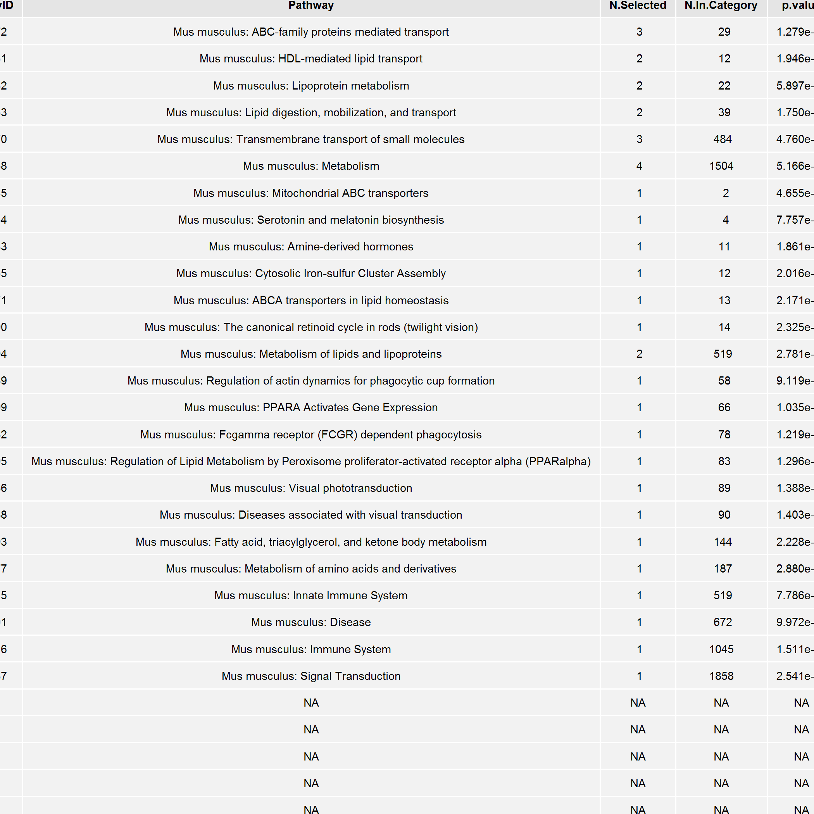
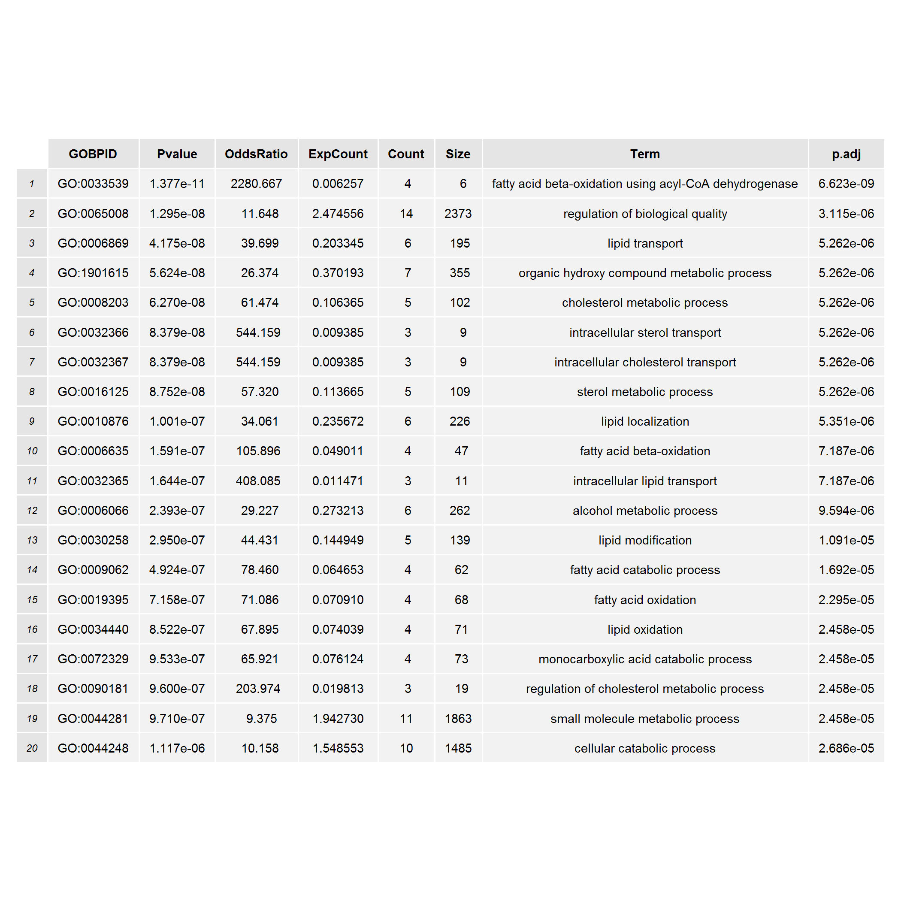
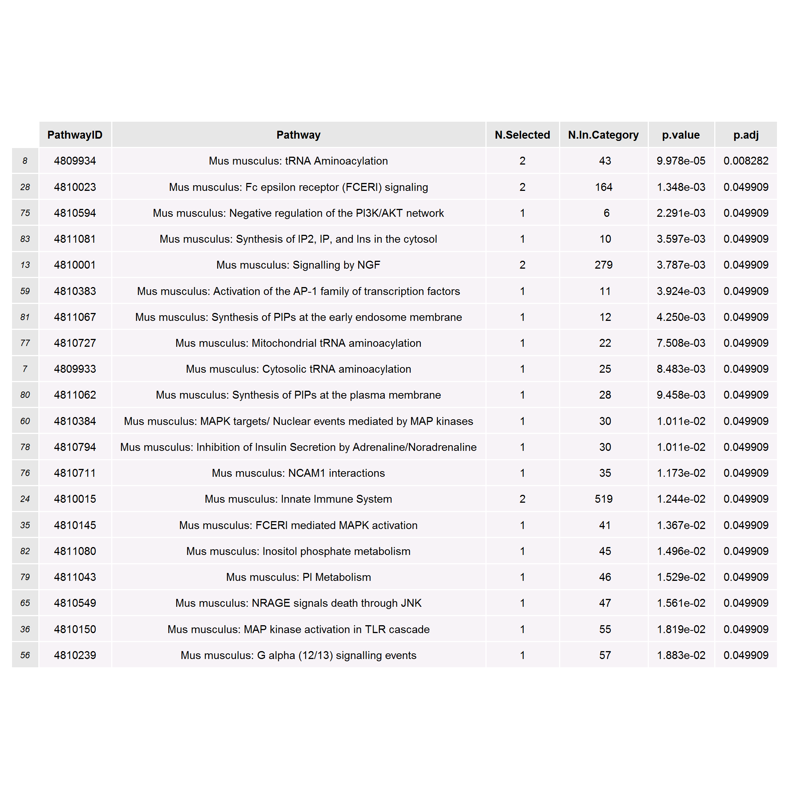
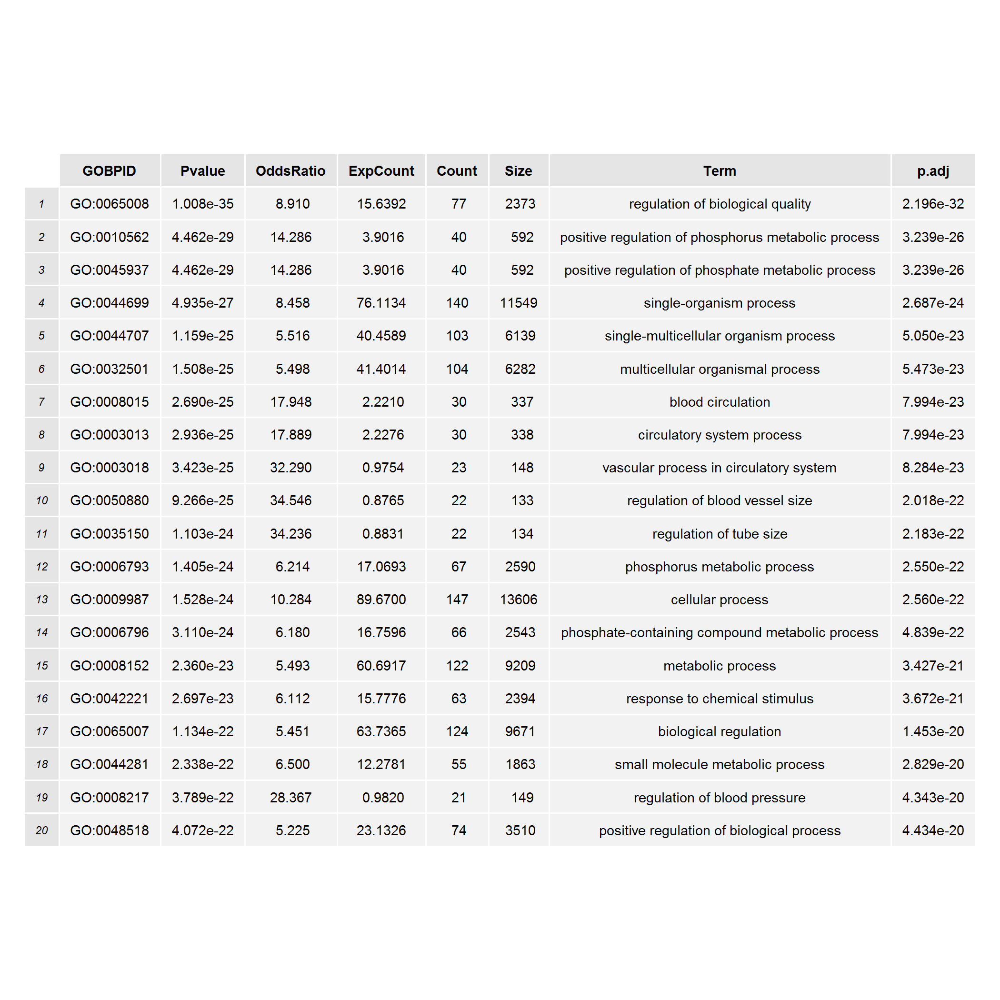
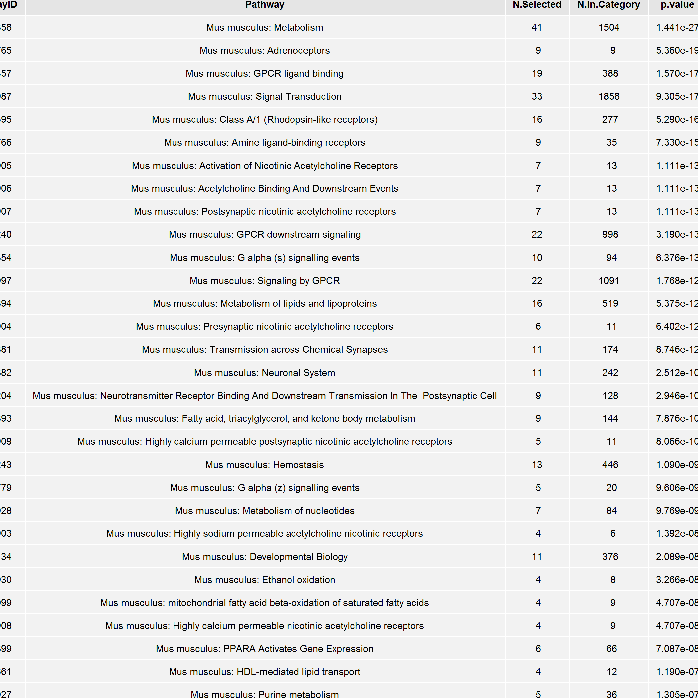

Understanding the biology of RepeatSoaker effect
=================================================


Our goal is to see whether thrown away genes may be biologically interesting. What are we losing after RepeatSoaker?

We check unique genes from the Venn diagram for GO and pathway enrichment.

Unique genes without RepeatSoaker
---------------------------------


```
## The number of enriched GOs:520
```




```
## The number of enriched pathways:80
```




Unique genes with 75% RepeatSoaker
----------------------------------


```
## The number of enriched GOs:358
```




```
## The number of enriched pathways:30
```




Unique genes with 50% RepeatSoaker
----------------------------------


```
## The number of enriched GOs:315
```




```
## The number of enriched pathways:21
```




Unique genes with 25% RepeatSoaker
---------------------------------


```
## The number of enriched GOs:481
```




```
## The number of enriched pathways:52
```




Unique genes with 00% RepeatSoaker
---------------------------------


```
## The number of enriched GOs:2178
```




```
## The number of enriched pathways:198
```



