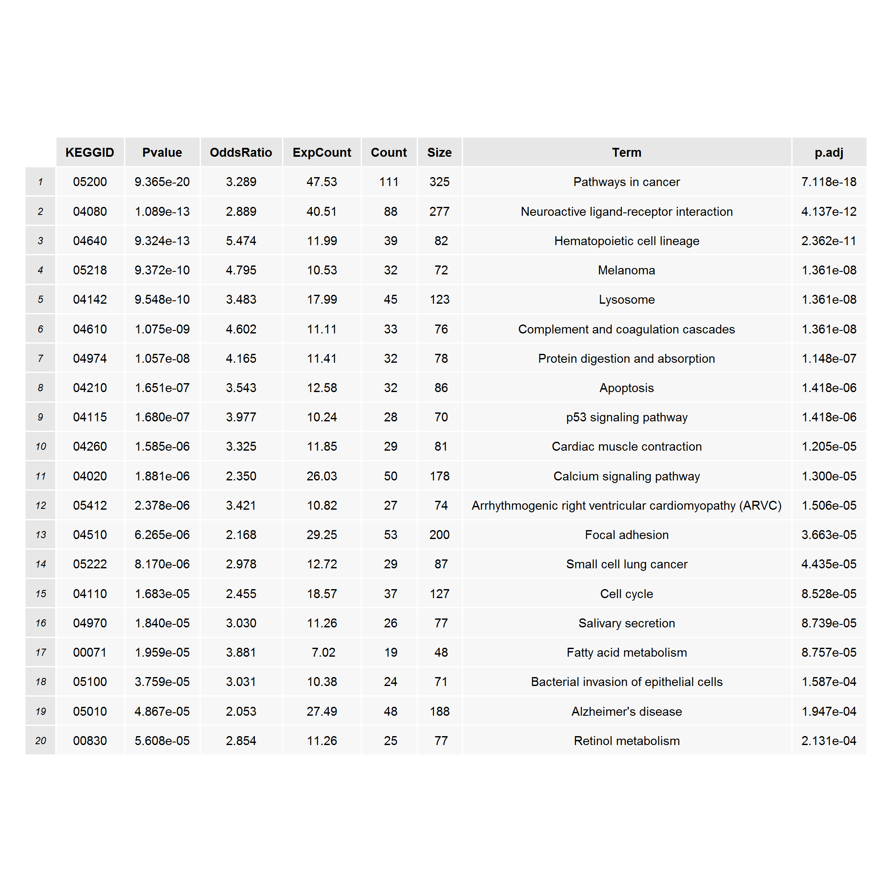
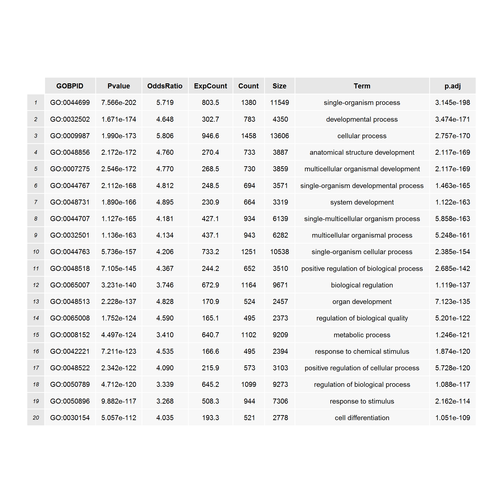
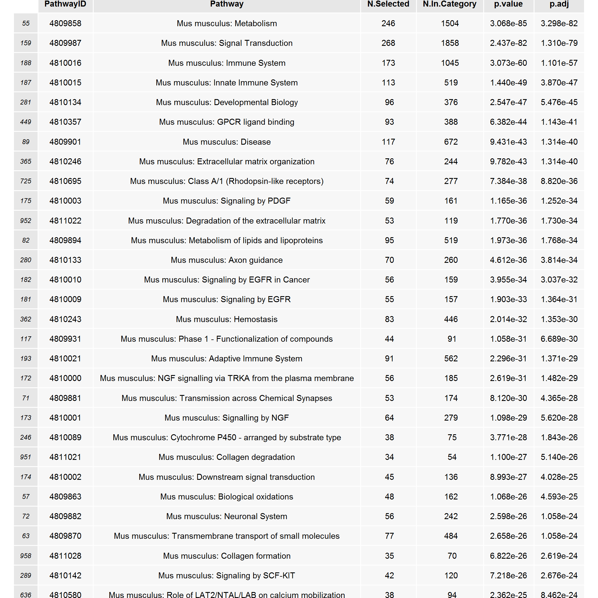
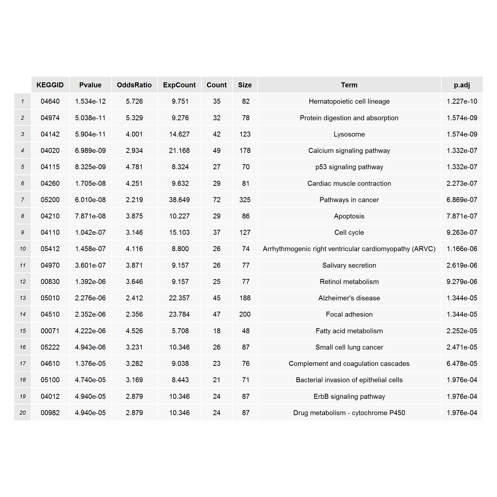
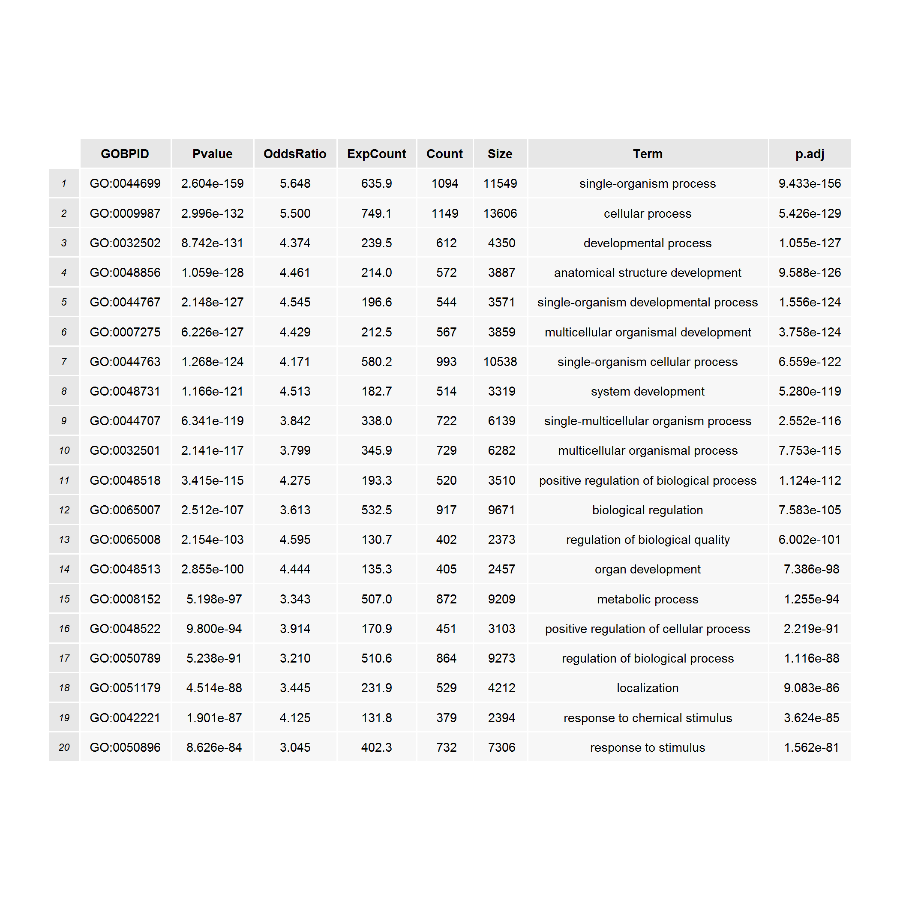
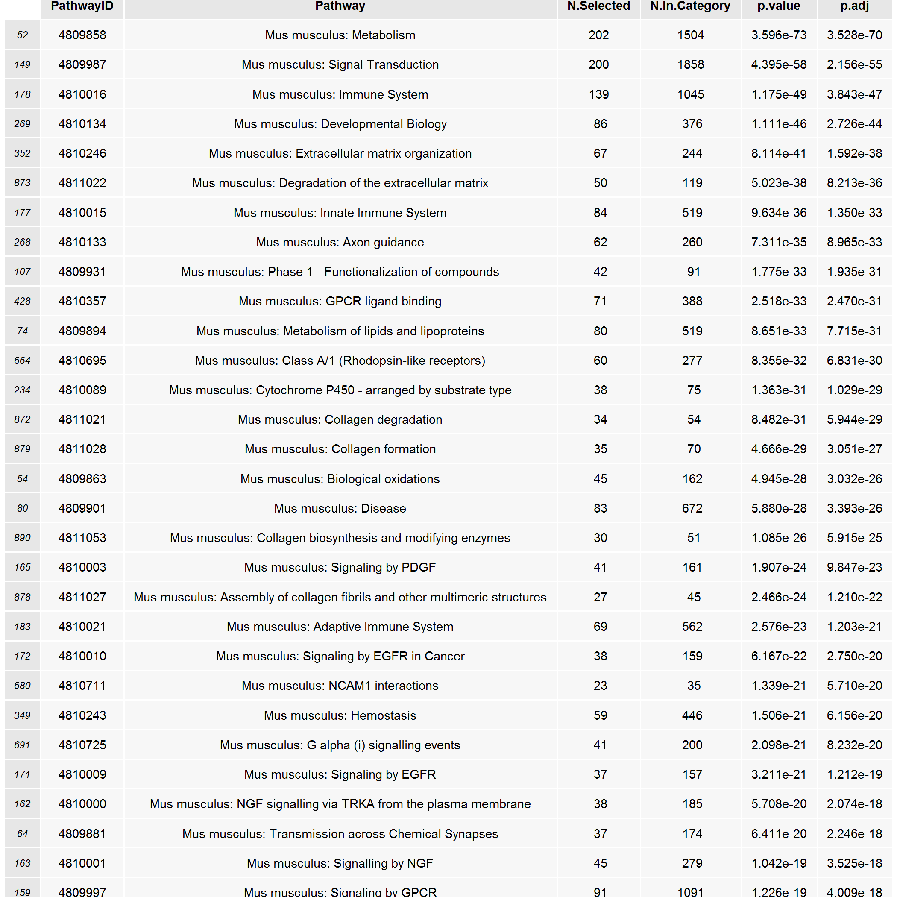

Understanding the biology of RepeatSoaker effect
=================================================


Our goal is to see whether thrown away genes may be biologically interesting. What are we losing after RepeatSoaker?

We check unique genes from the Venn diagram for GO and pathway enrichment.

Unique genes without RepeatSoaker
---------------------------------


```
## 
## KEGG.db contains mappings based on older data because the original resource was removed from the the public
##   domain before the most recent update was produced. This package should now be considered deprecated and
##   future versions of Bioconductor may not have it available.  Users who want more current data are
##   encouraged to look at the KEGGREST or reactome.db packages
## 
## The number of enriched GOs:12
```


```
## The number of enriched GOs:520
```


```
## The number of enriched pathways:80
```


Unique genes with 75% RepeatSoaker
----------------------------------


```
## The number of enriched GOs:3
```


```
## The number of enriched GOs:358
```


```
## The number of enriched pathways:30
```


Unique genes with 50% RepeatSoaker
----------------------------------


```
## The number of enriched GOs:3
```


```
## The number of enriched GOs:315
```


```
## The number of enriched pathways:21
```


Unique genes with 25% RepeatSoaker
---------------------------------


```
## The number of enriched GOs:10
```


```
## The number of enriched GOs:481
```


```
## The number of enriched pathways:52
```


Unique genes with 00% RepeatSoaker
---------------------------------


```
## The number of enriched GOs:43
```


```
## The number of enriched GOs:2178
```


```
## The number of enriched pathways:198
```


Comparing genes without and with RepeatSoaker treatment
========================================================
Genes without RepeatSoaker
----------------------------

```
## The number of enriched GOs:76
```




```
## The number of enriched GOs:4157
```




```
## The number of enriched pathways:637
```




Genes with RepeatSoaker
--------------------------

```
## The number of enriched GOs:80
```




```
## The number of enriched GOs:3622
```




```
## The number of enriched pathways:538
```




